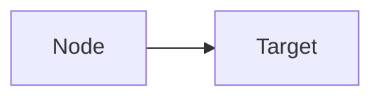

# llm-wiki-obsidian

Personal knowledge base management based on Karpathy's LLM Wiki pattern.

## Quick Commands

- organize knowledge base - Run full organize workflow
- ingest [article] - Add new source to wiki
- query [topic] - Search and answer from wiki
- lint wiki - Health check

## Architecture

```
knowledge-base/
├── raw/                    # Raw materials (immutable)
├── wiki/                   # LLM-generated Wiki
│   ├── entities/          # Entity pages
│   ├── concepts/         # Concept pages
│   ├── sources/          # Source summaries
│   └── synthesis/        # Synthesis analysis
├── index.md               # Content catalog
└── log.md                # Operation log
```

## Core Principles

1. Raw/ immutable — Never modify raw sources
2. LLM owns wiki/ — Auto maintain
3. Cross-reference everything — [[wikilinks]]
4. Flag contradictions — ⚠️ Contradicts [[X]]
5. Update index.md — After each change
6. Log operations — To daily note

## Page Types

- Entity: wiki/entities/ - People, organizations, projects
- Concept: wiki/concepts/ - Technical concepts, theories
- Source: wiki/sources/ - Source summaries
- Synthesis: wiki/synthesis/ - Analysis articles

## Obsidian Syntax

### Mermaid Flowcharts


### Markdown Tables
- Blank line required between heading and table

### Wikilinks
- [[Page Name]] - correct
- [[Page Name|Path]] - wrong