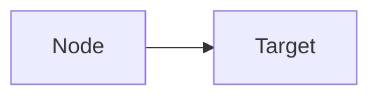

# AGENTS.md — Multi-Agent Bootstrap

This file provides agent-specific instructions for LLM Wiki Obsidian skill.

## Supported Agents

| Agent | Bootstrap File | Interface |
|-------|---------------|-----------|
| Claude Code | `CLAUDE.md` | Native tools + Obsidian CLI |
| Cursor | `.cursor/rules/llm-wiki-obsidian.mdc` | Bash + File ops |
| Windsurf | `.windsurf/rules/llm-wiki-obsidian.md` | Bash + File ops |
| Codex | `AGENTS.md` | Bash + File ops |
| Hermes | `.hermes.md` | Bash + File ops |
| OpenClaw | `AGENTS.md` + symlink | Bash + File ops |
| GitHub Copilot | `.github/copilot-instructions.md` | Bash + File ops |

## Quick Commands

- **organize knowledge base** - Run full organize workflow
- **ingest [article]** - Add new source to wiki
- **query [topic]** - Search and answer from wiki
- **lint wiki** - Health check
- **sync clippings** - Move clippings to raw/

## Architecture

```
knowledge-base/
├── raw/                    # Raw materials (immutable)
│   ├── articles/          # Articles
│   ├── papers/            # Papers
│   └── assets/           # Images
├── wiki/                   # LLM-generated Wiki
│   ├── entities/          # Entity pages
│   ├── concepts/         # Concept pages
│   ├── sources/          # Source summaries
│   └── synthesis/        # Synthesis analysis
├── index.md               # Content catalog
└── log.md                # Operation log
```

## Core Principles

1. **Raw/ immutable** — Never modify raw sources
2. **LLM owns wiki/** — Auto maintain
3. **Cross-reference everything** — `[[wikilinks]]`
4. **Flag contradictions** — `⚠️ Contradicts [[X]]`
5. **Update index.md** — After each change
6. **Log operations** — To daily note

## Obsidian CLI (when available)

```bash
# Search
obsidian search query="keyword" limit=10

# Read
obsidian read file="PageName"

# Create
obsidian create name="wiki/sources/Title" content="# Title\n\nContent" silent

# Append
obsidian append file="PageName" content="New paragraph"

# Daily note
obsidian daily:append content="- [ ] Task"
```

## Page Templates

### Entity (wiki/entities/)
```markdown
---
type: entity
category: person|project|organization
tags: [tag1]
date: 2026-04-17
---
# Entity Name
## Basic Info
## Relations
- [[Related Entity]]
## Sources
```

### Concept (wiki/concepts/)
```markdown
---
type: concept
tags: [tag1]
date: 2026-04-17
sources: [raw/original.md]
---
# Concept Name
> One-sentence definition
## Key Points
## Related Concepts
```

### Source (wiki/sources/)
```markdown
---
type: source
date: 2026-04-17
url: https://...
tags: [tag1]
---
# Title
## Summary
## Key Info
## Relations
```

### Synthesis (wiki/synthesis/)
```markdown
---
type: synthesis
tags: [analysis]
date: 2026-04-17
---
# Synthesis: XXX
## Key Findings
## Analysis
## Sources
```

## Obsidian Syntax Rules

### Mermaid Flowcharts

- Use ` ```mermaid ` (three backticks)
- Avoid Chinese in node IDs: use `A[中文]` format
- Avoid consecutive arrows: split `A --> B --> C` into separate arrows

### Markdown Tables
- **REQUIRED**: Blank line between heading and table
```markdown
## Heading

| Col1 | Col2 |
|------|------|
| Val1 | Val2 |
```

### Wikilinks
- **Correct**: `[[Page Name]]`
- **Wrong**: `[[Page Name|Path]]`

### Source References
- **Preferred**: `[[来源-标题]]`
- **Alternative**: `原始文件：raw/articles/日期-标题.md`

---

For full documentation, see [GitHub](https://github.com/dreamor/llm-wiki-obsidian).